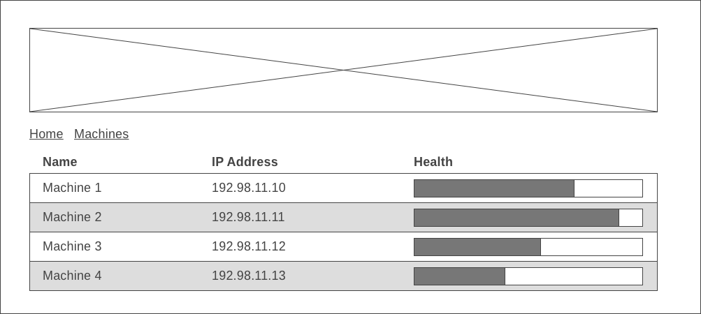
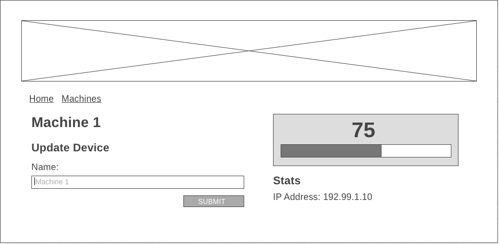

---

# Entrolics Engineering React Challenge

Entrolics centralizes the management of Entrolics Gaming Machines through an administrative interface as a SaaS Platform built using React.

In order to provide more value to this offering, we add features to the management of machines frequently.

## Background

Entrolics is the combination of the Entrolics Gaming Machine which is a specially developed cabinet unit allowing 2 or 4 player physical configurations running MAME arcade games and the Entrolics SaaS Platform allowing remote operation and management of Entrolics Gaming Machines for our clients.

This repo presents a base version of the Administrative UI for managing Entrolics Gaming Machines remotely from the Entrolics SaaS Platform through individual machine's settings.

## Challenge

Update the Administrative Interface to render a list of all machines, along with the ability to view an individual machine's details. Each machine receives real-time updates from a web socket, which need to be reflected in the UI.

To get started, run `npm run server` to start the backend server, and `npm start` to start Webpack.

The backend API is accessible from `http://localhost:8080` and exposes two endpoints:

- GET `/machines` - get all machines
- GET `/machines/:machineId` - get a machine by its ID
- PUT `/machine/:machineId` - update a machine

The web socket url is `ws://localhost:1337`.

1. Add a new reducer to the existing store for the machines
   - Each machine will have the following data:
     - `name`
     - `ip_address`
     - `health`
2. Render a list of machines on the `/machines` route
   - Match the layout to the best of your ability:  
   - Use data from the machines reducer to render a list view of the machines
   - Each machine list item will render the following data:
     - Name
     - IP Address
     - Health
   - Subscribe to updates from the web socket to get the latest `health` for each machine.
   - Clicking the list item for a machine will navigate to `/machines/:machineId`
3. Render a view for a single machine on the `/machines/:machineId` route
   - Match the layout to the best of your ability:  
   - Show the following data:
     - Name
     - IP Address
     - Health
   - Subscribe to updates from the web socket to get the latest health for the machine.
   - Allow for the "Name" of the machine to be updated.
4. Build a reusable `<Health>` component that is used by both the `/machines` and `/machines/:machineId` view, with the ability to optionally render the health as a numerical value for `/machines/:machineId`. The meter will render a color based upon the health value that it reflects:
   - 0-50: `#D9534F`
   - 51-70: `#f0ad4e`
   - 71-100: `#5cb85c`

* Each Component should have a test
* Add Redux to manage the new state being introduced for this challenge
* Call a REST API to store the changes made back to the SaaS Platform for use by the Machines

## Instructions

How to attempt this challenge:

1. Create a new repo in your account and note the git url
2. Clone this repo
3. Solve the challenge
4. Set your new repo as the origin: `git remote set-url origin ${your repo url}`
5. Push your solution to your repo

You must follow these steps for your solution to be accepted -- forks or other methods will not be considered.
